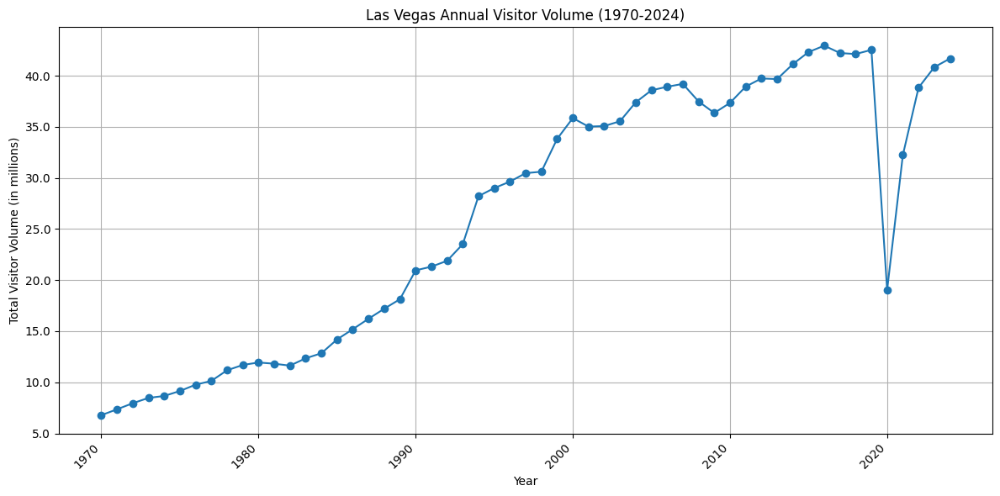
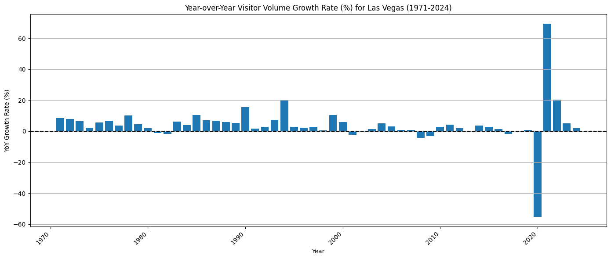

# Las-Vegas-Tourism-Analysis

## Introduction & Goal

This project undertakes an analysis of historical tourism data for Las Vegas, examining annual trends over more than five decades, from 1970 to 2024. The primary data source is the comprehensive "Las Vegas Historic Tourism Statistics" report provided by the Las Vegas Convention and Visitors Authority (LVCVA). The data was originally in a PDF format and was subsequently processed and cleaned for this analysis.

The main objective of this project is to:
* Identify and visualize the long-term trends in annual visitor volume to Las Vegas.
* Pinpoint key periods of significant growth, stagnation, or decline.
* Discuss how these trends might visually correlate with known major economic events or significant local developments (e.g., the COVID-19 pandemic, economic recessions).

This exploratory analysis aims to provide a clear overview of the evolution of Las Vegas as a major tourist destination based on its historical visitor data.

## Data Sourcing & Preparation

The primary data for this analysis was sourced from the "Las Vegas Historic Tourism Statistics (1970-2024)" report, a PDF document published by the Las Vegas Convention and Visitors Authority (LVCVA). This report contains annual data for various tourism indicators crucial for understanding long-term trends.

The data preparation process involved several stages to transform the raw PDF data into a clean, analyzable format:

1.  **Initial Extraction & Manual Cleaning:** Due to the complexities of directly parsing the PDF programmatically for all tables, the PDF was first converted to a CSV file. This CSV was then meticulously reviewed and cleaned in Google Sheets. This manual step addressed initial parsing issues, corrected header alignment, removed irrelevant non-data rows, and ensured a more structured tabular format suitable for import.
2.  **Loading into Pandas & Further Refinement:** The cleaned CSV file was subsequently uploaded to Google Drive and loaded into a Pandas DataFrame within a Google Colab environment for final programmatic cleaning and preparation.
3.  **Header Correction & Row Trimming (in Pandas):**
    * The correct row containing the column headers (e.g., "Year", "Visitor Volume", "Convention Attendance") was identified and programmatically set as the DataFrame's column headers.
    * Any remaining non-data rows at the beginning (above the true header) and footer rows (containing notes, sources, or compilation information) were removed to isolate the core data spanning from 1970 to 2024.
4.  **Column Name Standardization:** Column names were standardized by stripping any leading/trailing whitespace. Typographical errors in column names (such as "Vistitor Volume" being corrected to "Visitor Volume") were also addressed.
5.  **Data Type Conversion & Cleaning (Key Columns):**
    * The **'Year'** column was converted to an integer data type.
    * The **'Visitor Volume'** column required cleaning to remove comma separators from the numerical strings. After cleaning, it was converted to an integer data type. It was verified that these numbers represent the actual visitor counts and did not require further scaling (e.g., multiplication by 1000).
6.  **Final Verification:** After these steps, the resulting DataFrame used for analysis contained 55 entries, one for each year from 1970 to 2024, with no missing values in the critical 'Year' and 'Visitor Volume' columns.

## Analysis & Key Findings

The analysis of cleaned annual Las Vegas visitor data from 1970 to 2024 revealed significant long-term trends and specific periods of notable change.

### Overall Visitor Volume Trend

The annual visitor volume showed a strong general upward trend from approximately 6.8 million in 1970, reaching a peak of about 42.5 million in 2019 before the pandemic-induced drop. Key periods of accelerated growth were observed, particularly in the 1990s. There were also noticeable dips corresponding to economic downturns, such as around 2008-2009 (dropping to about 36.4 million), and a dramatic plunge in 2020 to approximately 19 million due to the COVID-19 pandemic. The subsequent years showed a strong recovery, with visitor numbers climbing back towards approximately 40.8 million by 2023.

### Year-over-Year (YoY) Growth Rate

To better understand the dynamics and volatility of visitor volume changes, the year-over-year (YoY) growth rate was calculated and analyzed.

The YoY growth bar chart vividly illustrates periods of rapid change. The most significant negative growth occurred in 2020, with an approximate drop of -55% due to the COVID-19 pandemic. This was followed by the largest positive growth in 2021, a rebound of around +68% to +70%. Other notable years of strong positive growth included 1996 (approx. +20%), 1992 (approx. +15%), and 2022 (approx. +20%). Periods of smaller decline were evident around 2008-2009 (approx. -4% to -5% each), corresponding to the financial crisis. The chart clearly illustrates that while Las Vegas visitor numbers have experienced ups and downs, the impact of the 2020 event and the subsequent rebound in 2021 were unprecedented in scale over this period.

### Discussion of Key Periods and Events

The sustained growth throughout the 1990s can be attributed to significant investment and the opening of several mega-resorts, which transformed Las Vegas into a premier global destination. The declines in 2008-2009 align with the Global Financial Crisis, which impacted discretionary travel spending worldwide. The unprecedented disruption in 2020 and the subsequent strong recovery directly reflect the impact of the COVID-19 pandemic and the subsequent easing of travel restrictions, highlighting the vulnerability and resilience of Las Vegas's tourism-dependent economy.

## Conclusion

The analysis of Las Vegas' annual visitor volume from 1970 to 2024 reveals a clear long-term growth trend, although this growth has been punctuated by notable periods of decline, particularly during major economic downturns and global events like the COVID-19 pandemic. The Year-over-Year growth rate analysis further highlighted the dynamic nature of the tourism sector, showcasing significant fluctuations and periods of rapid recovery, especially following the 2020 downturn. While this study focused on annual trends due to the nature of the readily available historical data, future analysis could greatly benefit from more granular data (e.g., monthly visitor statistics) to explore seasonality in detail and delve deeper into the specific factors and events driving the observed patterns.

## Tools Used

The following tools and libraries were primarily utilized for this Las Vegas tourism trend analysis:

* **Python:** The core programming language.
* **Google Colab:** The cloud-based Jupyter notebook environment used for coding and execution.
* **Google Sheets:** Utilized for the initial manual cleaning and structuring of the data after PDF conversion.
* **Pandas:** For data loading, manipulation, cleaning, and calculation of the Year-over-Year growth rate.
* **NumPy:** For numerical operations, often used in conjunction with Pandas.
* **Matplotlib:** The foundational library for creating plots.
* **Seaborn:** Used on top of Matplotlib for enhanced statistical visualizations (line plot and bar chart).

  ## Code

The complete data cleaning, analysis, and visualization process for this project can be found in the Jupyter Notebook file located in this repository:

[LVCVA_Annual_Vistors.ipynb](https://colab.research.google.com/drive/12tCyIoUVm8NzBoe04MxlGM-nwA_ntZ6M?usp=sharing)
